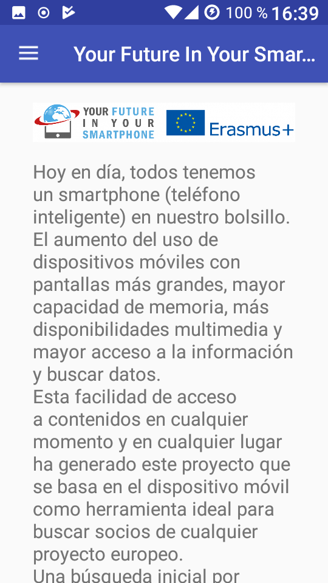
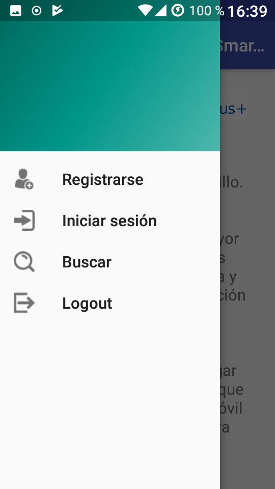
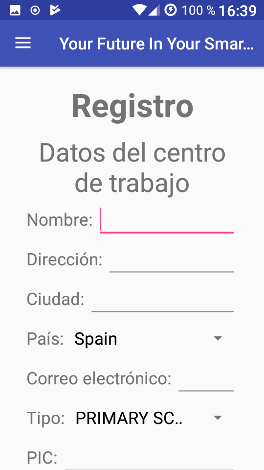
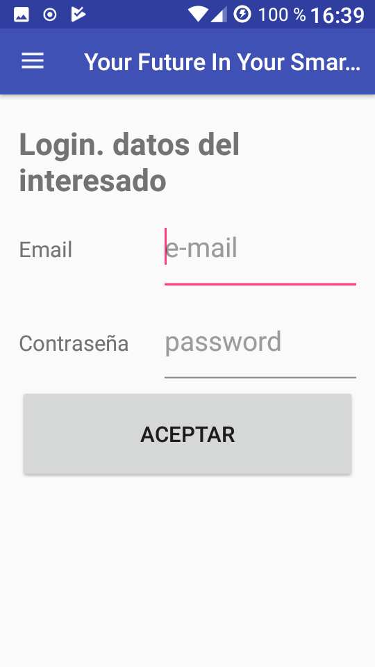
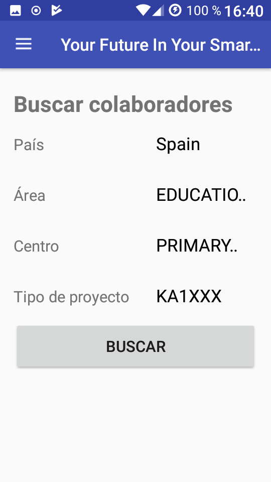
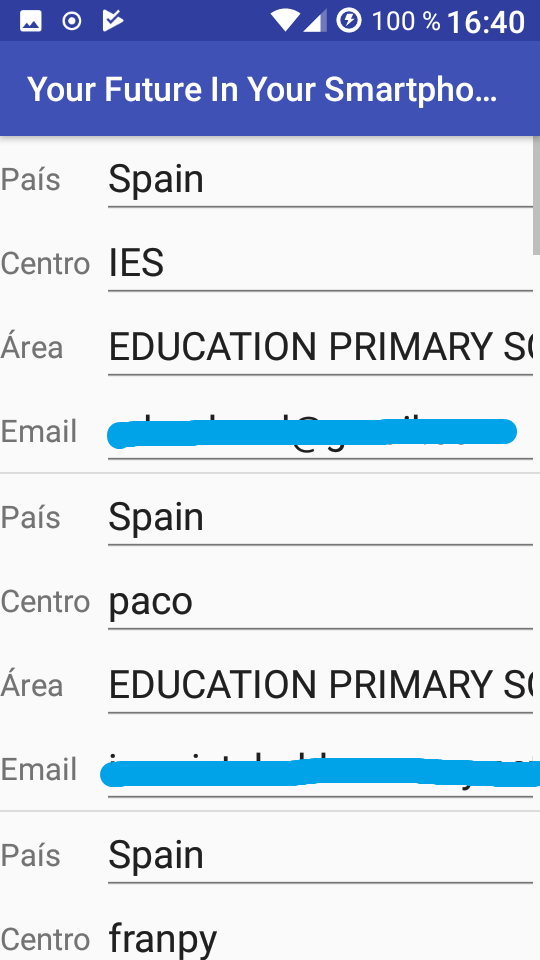
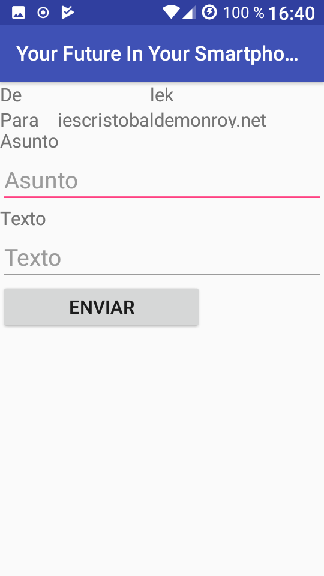

# Buscador de socios erasmus

Aplicación ***Android*** que permite buscar y contactar con socios colaboradores para proyectos erasmus solicitada por Orlando Soldan de IES Cristóbal de Monroy.

- - - -

# Navegación
 

> [:octocat: Repositorio GitHub](https://github.com/Monroy2DAM/YourFutureInYourSmartphone) 
> [:scroll: Mapa de versiones](https://github.com/Monroy2DAM/YourFutureInYourSmartphone/network) 
> [:arrow_down: Releases](https://github.com/Monroy2DAM/YourFutureInYourSmartphone/releases) 
> [:memo: Tareas y mejoras propuestas](https://github.com/Monroy2DAM/YourFutureInYourSmartphone/issues) 
> [:blue_book: Guía de Git](https://github.com/ismenc/seminario-git) 

- - - -

# ¿Cómo colaborar?

     
Instrucciones

 

  <!-- alternative placement of p shown above -->

  1. :v: Haz un fork del repositorio y posteriormente descárgalo `git clone <url>`.
  2. :open_file_folder: Navega a la carpeta del proyecto `cd <carpeta>`.
  3. :memo: Crea una nueva rama `git checkout -b <nombre-rama>` y luego haz tus cambios.
  4. :sparkles: Añade los cambios `git add *` y haz el commit: `git commit -am "Resumen de cambios"`.
  5. :arrow_up: Sube la nueva rama: `git push origin <nombre-rama>`.
  6. :email: Inicia un pull request en el repositorio :D

:octocat: Si deseas aprender Git, visita mi [guía sobre Git](https://github.com/ismenc/seminario-git).
      

- - - -

# Índice
 

* Índice de contenidos
  * [1. Funcionamiento](#1-funcionamiento-de-la-aplicación)
  * [2. Documentación](#2-documentación)
  * [3. Fallos conocidos](#3-fallos-conocidos)
  * [4. Colaboradores](#3-Colaboradores)

- - - -
 

## 1. Funcionamiento de la aplicación

1. La aplicación carga y muestra al usuario una pantalla de bienvenida y un menú lateral.
2. A través del menú, el usuario puede acceder a: registro, login, búsqueda de socios y logout.
3. Cada una de esas pantallas conecta con una base de datos externa para operar correctamente.

## 2. Documentación

El proyecto consta de varias pantallas. En cada una de ellas, la clase java correspondiente se comunica con la base de datos mediante las tecnologías de JSON y PHP para operar.

## 3. Fallos conocidos

Errores conocidos y sus causas o soluciones

### Cannot resolve AppCompActivity

Las siguientes opciones pueden solucionarlo:

* Clean/Build/Rebuild project.
* File -> Invalidate Caches / Restart
* En gradle, cambiar el compile de AppCompActivity a otro, sincronizar y volver a ponerlo como originalmente estaba

### "Please select SDK"

Posible solución:

   > File -> Project structure... -> Project -> Cambia JDK location al directorio de instalación de Java JDK

## 4. Colaboradores

Colaborador | Aporte
------------ | ------------
[Ismael Núñez](https://github.com/ismenc) | Login, búsqueda, envío de email, traducción a inglés
[Francisco Rodríguez](https://github.com/KerosenoDev) | Inicio, menú, registro de persona, proyecto, organización
